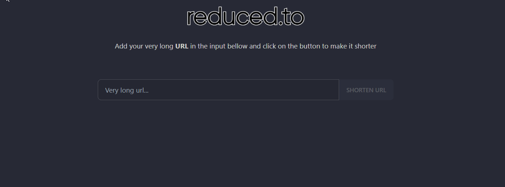

<a name="readme-top"></a>

<!-- PROJECT SHIELDS -->
<div align="center">

[![Contributors][contributors-shield]][contributors-url]
[![Forks][forks-shield]][forks-url]
[![Stargazers][stars-shield]][stars-url]
[![Issues][issues-shield]][issues-url]

</div>

<!-- PROJECT LOGO -->
<br />
<div align="center">
  
[](https://reduced.to)

[](https://reduced.to)

  <p align="center">
    Reduced.to is a modern web application that reduces the length of link URL. So it's easier to remember, share and track.
    <br />
    <br />
    <a href="https://reduced.to">App</a>
    ·
    <a href="https://github.com/origranot/reduced.to/issues/new?assignees=&labels=bug%2Ctriage&template=bug.yml">Report Bug</a>
    ·
    <a href="https://github.com/origranot/reduced.to/issues/new?assignees=&labels=enhancement%2Ctriage&template=feature_request.yml">Request Feature</a>
  </p>
</div>
<br />

<!-- TABLE OF CONTENTS -->
<details>
  <summary>📚 Table of Contents</summary>
  <ol>
    <li>
      <a href="#-about-the-project">🌐 About The Project</a>
      <ul>
        <li><a href="#-built-with">🔥 Built With</a></li>
      </ul>
    </li>
    <li>
      <a href="#-getting-started">🚀 Getting Started</a>
      <ul>
        <li><a href="#-prerequisites">📃 Prerequisites</a></li>
        <li><a href="#-installation">💻 Installation</a></li>
        <li><a href="#-development">👩‍💻 Development</a></li>
        <li><a href="#-docker">🐳 Docker</a></li>
        <li><a href="#-docker-compose">🐙 Docker Compose</a></li>
        <li><a href="#-configuration">👷 Configuration</a></li>
      </ul>
    </li>
    <li><a href="#-usage">🐱‍💻 Usage</a></li>
    <li><a href="#-roadmap">🧱 Roadmap</a></li>
    <li><a href="#-contributing">🥇 Contributing</a></li>
    <li><a href="#-contributors">🏆 Contributors</a></li>
    <li><a href="#-license">📝 License</a></li>
    <li><a href="#-contact">💌 Contact</a></li>
  </ol>
</details>
<br/>

<!-- ABOUT THE PROJECT -->

## 🌐 About The Project

<div align="center">

</div>

### 🔥 Built With

List of frameworks/libraries used to bootstrap the project.

- [![NX][nx]][nx-url]
- [![Nest][nestjs]][nest-url]
- [![Qwik][qwik.js]][qwik-url]
- [![Tailwindcss][tailwindcss]][tailwindcss-url]
- [![Novu][novu]][novu-url]

<p align="right">(<a href="#readme-top">back to top</a>)</p>

<!-- GETTING STARTED -->

## 🚀 Getting Started

### 📃 Prerequisites

List of things you need to run the project locally and how to install them.

- npm
  ```sh
  npm install npm@latest -g
  ```
- docker
  ```sh
  https://docs.docker.com/get-docker/
  ```

### 💻 Installation

1. [Fork](https://github.com/origranot/reduced.to/fork) / Clone this repository
2. Install NPM packages
   ```sh
   npm install
   ```
3. Copy `.example.env` to `.env` and fill it properly (see [Configuration](#-configuration))
4. Make sure you have a local instance of PostgreSQL running on port 5432. If not, you can run it using docker:
   ```sh
   docker run --name reduced_to_db -e POSTGRES_USER=postgres -e POSTGRES_PASSWORD=postgres -e POSTGRES_DB=reduced_to_db -p 5432:5432 -d postgres
   ```
5. Run Prisma migration from root folder:
   ```sh
   npx nx migrate-dev prisma --name=init
   ```
6. Run the backend from root folder:
   ```sh
   npx nx serve backend
   ```
7. Run the frontend from root folder:
   ```sh
   npx nx serve frontend
   ```

### 👩‍💻 Development

The project is structured in the following way:

```
.
├── apps/
│   ├── backend
│   └── frontend
└── libs/
    ├── config
    └── prisma
```

### 🐳 Docker

You can build the docker images by running the following nx command:

```sh
npx nx run-many -t docker-build
```

- This command will automatically build the dependencies and the backend and frontend images.

### 🐙 Docker compose

- In case you have docker installed, you can _single-click_ deploy and test your changes by running the following and going to `http://localhost:5000/` on your browser.
- When you run the command below, don't forget to change the .env file with the correct values.

  ```sh
  docker compose -f docker/local/docker-compose.yml -p reduced-to up
  ```

### 👷 Configuration

For the minimal configuration you can just rename the `.example.env` files to `.env`.

###### General

- **BACKEND_APP_PORT**: Backend port
- **FRONTEND_APP_PORT**: Frontend port
- **NODE_ENV**: Node environment (development / production)

###### Database

- **DATABASE_URL**: Database connection string

###### Rate Limit

- **RATE_LIMIT_TTL**: Rate limit TTL (time to live)
- **RATE_LIMIT_COUNT**: Number of requests within the ttl

###### Logger

- **LOGGER_CONSOLE_THRESHOLD**: Threshold level of the console transporter.

###### Frontend

- **DOMAIN**: Domain of your frontend app
- **API_DOMAIN**: Domain of your backend instance (used for server side requests)
- **CLIENTSIDE_API_DOMAIN**: Domain of your backend instance (used for client side requests)

###### Redis

- **REDIS_ENABLE**: Whether to use external redis store or not
- **REDIS_HOST**: Redis instnace host
- **REDIS_PORT**: Redis instance port
- **REDIS_PASSWORD**: Redis instance password
- **REDIS_TTL**: Redis ttl (in seconds)

###### Auth

- **JWT_ACCESS_SECRET**: Jwt secret (used for access tokens)
- **JWT_REFRESH_SECRET**: Jwt secret (used for refresh tokens)

###### Novu

- **NOVU_API_KEY**: Get it from https://novu.co/, you don't need this when running locally (just verify your email from the database)

Happy Hacking !

<p align="right">(<a href="#readme-top">back to top</a>)</p>

<!-- USAGE EXAMPLES -->

## 🐱‍💻 Usage

Simply copy and paste a URL into the provided area. Then click shorten URL! Your URL has now been shortened!

<div align="center">

</div>

<p align="right">(<a href="#readme-top">back to top</a>)</p>

<!-- ROADMAP -->

## 🧱 Roadmap

- [x] Migrate backend to NestJS
- [x] Migrate frontend to Qwik
- [x] Better README
- [x] Generate QRCode
- [x] Split front-end into components
- [x] Better UI
  - [x] Animations
  - [x] Logo
  - [x] Dark/Light mode
- [ ] Improve front-end components
- [x] Backend tests
- [x] Migration to Nx
- [ ] Split backend into libs
- [ ] Support k8s deployment (helm)
- [ ] Front-end Tests
- [ ] Logs
- [ ] Add a statistics page
- [ ] Add more ideas

Just create a [Pull request](https://github.com/origranot/reduced.to/pulls) already 😃

_See the [open issues](https://github.com/origranot/reduced.to/issues) for a full list of proposed features (and known issues)._

<p align="right">(<a href="#readme-top">back to top</a>)</p>

<!-- CONTRIBUTING -->

## 🥇 Contributing

Contributions are what make the open-source community such an amazing place to learn, inspire, and create. Any contributions you make are **greatly appreciated**.

If you have a suggestion that would make this better, please fork the repo and create a pull request. You can also simply open an issue with the tag "enhancement".
Don't forget to give the project a star ⭐!

1. Fork the Project
2. Create your Feature Branch (`git checkout -b feature/AmazingFeature`)
3. Commit your Changes (`git commit -m 'Add some AmazingFeature'`)
4. Push to the Branch (`git push origin feature/AmazingFeature`)
5. Open a Pull Request

## 🏆 Contributors

<a href = "https://github.com/origranot/reduced.to/graphs/contributors">
  
</a>
<p align="right">(<a href="#readme-top">back to top</a>)</p>

<!-- LICENSE -->

## 📝 License

Distributed under the MIT License. See `LICENSE` for more information.

<p align="right">(<a href="#readme-top">back to top</a>)</p>

<!-- CONTACT -->

## 💌 Contact

Project Link: [https://github.com/origranot/reduced.to](https://github.com/origranot/reduced.to)

<p align="right">(<a href="#readme-top">back to top</a>)</p>

<!-- MARKDOWN LINKS & IMAGES -->

[contributors-shield]: https://img.shields.io/github/contributors/origranot/reduced.to.svg?style=for-the-badge
[contributors-url]: https://github.com/origranot/reduced.to/graphs/contributors
[forks-shield]: https://img.shields.io/github/forks/origranot/reduced.to.svg?style=for-the-badge
[forks-url]: https://github.com/origranot/reduced.to/network/members
[stars-shield]: https://img.shields.io/github/stars/origranot/reduced.to.svg?style=for-the-badge
[stars-url]: https://github.com/origranot/reduced.to/stargazers
[issues-shield]: https://img.shields.io/github/issues/origranot/reduced.to.svg?style=for-the-badge
[issues-url]: https://github.com/origranot/reduced.to/issues
[product-screenshot]: docs/gif.gif
[nx]: https://img.shields.io/static/v1?style=for-the-badge&message=Nx&color=143055&logo=Nx&logoColor=FFFFFF&label=
[nx-url]: https://nx.dev/
[nestjs]: https://img.shields.io/static/v1?style=for-the-badge&message=NestJS&color=E0234E&logo=NestJS&logoColor=FFFFFF&label=
[nest-url]: https://nestjs.com/
[qwik.js]: https://tinyurl.com/y67dv8ub
[qwik-url]: https://qwik.builder.io/
[tailwindcss]: https://img.shields.io/badge/tailwindcss-06B6D4?style=for-the-badge&logo=tailwindcss&logoColor=fff
[tailwindcss-url]: https://tailwindcss.com
[novu]: https://img.shields.io/badge/Novu-000000?style=for-the-badge&logo=novu&color=F30F8A
[novu-url]: https://novu.co/
