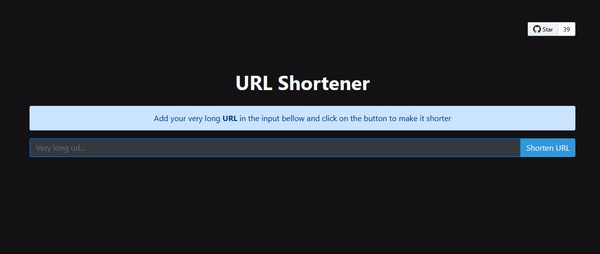

<div align="center">
  <h1 align="center">URL Shortener</h1>
  
  <!-- PROJECT SHIELDS -->
  <div align="center">

   [![Contributors][contributors-shield]][contributors-url]
   [![Forks][forks-shield]][forks-url]
   [![Stargazers][stars-shield]][stars-url]
   [![Issues][issues-shield]][issues-url]

  </div>

  <p align="center">
    URL shortener is a web application that reduces the length of link URL so it's easier to remember, share and track.
    <br />
    <br />
    <a href="https://url-shortener-live.herokuapp.com">View Demo</a>
    ·
    <a href="https://github.com/origranot/url-shortener/issues">Report Bug</a>
    ·
    <a href="https://github.com/origranot/url-shortener/issues">Request Feature</a>
  </p>
</div>
<br />

<!-- TABLE OF CONTENTS -->
<details>
  <summary>📚 Table of Contents</summary>
  <ol>
    <li>
      <a href="#about-the-project">🌐 About The Project</a>
      <ul>
        <li><a href="#built-with">🔥 Built With</a></li>
      </ul>
    </li>
    <li>
      <a href="#getting-started">🚀 Getting Started</a>
      <ul>
        <li><a href="#prerequisites">📃 Prerequisites</a></li>
        <li><a href="#installation">💻 Installation</a></li>
        <li><a href="#development">👩‍💻 Development</a></li>
        <li><a href="#docker">🐳 Docker</a></li>
        <li><a href="#docker-compose">🐙 Docker Compose</a></li>
      </ul>
    </li>
    <li><a href="#usage">🐱‍💻 Usage</a></li>
    <li><a href="#roadmap">🧱 Roadmap</a></li>
    <li><a href="#contributing">🥇 Contributing</a></li>
    <li><a href="#contribors">🏆 Contributors</a></li>
    <li><a href="#license">📝 License</a></li>
    <li><a href="#contact">💌 Contact</a></li>
  </ol>
</details>
<br/>

<!-- ABOUT THE PROJECT -->
## 🌐 About The Project

<div align="center">

[](https://github.com/origranot/url-shortener)

</div>

I've created this repository over 3 years ago, and have made it public for Hacktoberfest! This is a great opportunity for beginners to start their journey with contributing to open source. All PRs are welcome! :)

<p align="right">(<a href="#readme-top">back to top</a>)</p>

### 🔥 Built With

List of frameworks/libraries used to bootstrap the project.

* [![Nest][NestJS]][Nest-url]
* [![Qwik][Qwik.js]][Qwik-url]
* [![Bootstrap][Bootstrap.com]][Bootstrap-url]

<p align="right">(<a href="#readme-top">back to top</a>)</p>

<!-- GETTING STARTED -->
## 🚀 Getting Started

### 📃 Prerequisites

List of things you need to run the project locally and how to install them.
* npm
  ```sh
  npm install npm@latest -g
  ```

### 💻 Installation

1. [Fork](https://github.com/origranot/url-shortener/fork) the repo
2. Clone the repo
    ```sh
    git clone https://github.com/your_username_/url-shortener.git
    ```
3. Open the cloned repository using the `url-shortener.code-workspace` file (VSCode)
4. Install NPM packages
    ```sh
    npm install && npm run install:all
    ```
5. Build the project
    ```sh
    npm run build:all
    ```
6. Run the project
    ```sh
    npm run start:prod
    ```
7. Go on your browser and open 
    ```sh
    http://localhost:3000/
    ```
### 👩‍💻 Development
You will find 3 folders
* 🎯 `root`
* ✨ `url-shortener/frontend`
* 🚀 `url-shortener/backend`

### _Running the frontend in dev mode_
1. Move to the frontend folder
    ```sh
    cd ./frontend
    ```
2. Run the project (it will open a new window)
    ```sh
    npm run start
    ```
3. Vite will be now listening for changes in the code and reloading the solution

### _Running the backend in dev mode_
1. Move to the backend folder
    ```sh
    cd ./backend
    ```
2. Run the project (be sure that you built the frontend before)
    ```sh
    npm run start:dev
    ```
3. Nest will be now listening for changes in the code and reloading the solution

### 🐳 Docker
- You can easily build your application in a docker container and run it.
  ```sh
  docker build . -t url-shortener
  docker run -p 3000:3000 url-shortener
  ```
- Simply go to your favorite browser and visit `http://localhost:3000/` to see your application.

### 🐙 Docker compose
- In case you have docker installed, you can *single-click* deploy and test your changes by running the following and going to `http://localhost:3000/` on your browser.
  ```sh
  docker-compose up
  ```

Happy Hacking !

<p align="right">(<a href="#readme-top">back to top</a>)</p>

<!-- USAGE EXAMPLES -->
## 🐱‍💻 Usage

Simply copy and paste a URL into the provided area. Then click shorten URL! Your URL has now been shortened!

<div align="center">

[](https://github.com/origranot/url-shortener)

</div>

<p align="right">(<a href="#readme-top">back to top</a>)</p>

<!-- ROADMAP -->
## 🧱 Roadmap

- [x] Migrate backend to NestJS
- [x] Migrate frontend to Qwik
- [x] Better README
- [ ] Yarn instead of NPM
- [ ] Split front-end into components
- [ ] Better UI
    - [ ] Animations
    - [ ] Dark/Light mode
    - [ ] Fonts?
- [ ] Add some testing
- [ ] Add logs
- [ ] Add a statistics page
- [ ] Add more ideas

Just create a [Pull request](https://github.com/origranot/url-shortener/pulls) already 😃

_See the [open issues](https://github.com/othneildrew/Best-README-Template/issues) for a full list of proposed features (and known issues)._

<p align="right">(<a href="#readme-top">back to top</a>)</p>

<!-- CONTRIBUTING -->
## 🥇 Contributing

Contributions are what make the open source community such an amazing place to learn, inspire, and create. Any contributions you make are **greatly appreciated**.

If you have a suggestion that would make this better, please fork the repo and create a pull request. You can also simply open an issue with the tag "enhancement".
Don't forget to give the project a star ⭐!

1. Fork the Project
2. Create your Feature Branch (`git checkout -b feature/AmazingFeature`)
3. Commit your Changes (`git commit -m 'Add some AmazingFeature'`)
4. Push to the Branch (`git push origin feature/AmazingFeature`)
5. Open a Pull Request

## 🏆 Contributors
<a href = "https://github.com/origranot/url-shortener/graphs/contributors">
  
</a>
<p align="right">(<a href="#readme-top">back to top</a>)</p>


<!-- LICENSE -->
## 📝 License

Distributed under the MIT License. See `LICENSE.txt` for more information.

<p align="right">(<a href="#readme-top">back to top</a>)</p>

<!-- CONTACT -->
## 💌 Contact

Project Link: [https://github.com/origranot/url-shortener](https://github.com/origranot/url-shortener)

<p align="right">(<a href="#readme-top">back to top</a>)</p>

<!-- MARKDOWN LINKS & IMAGES -->
[contributors-shield]: https://img.shields.io/github/contributors/origranot/url-shortener.svg?style=for-the-badge
[contributors-url]: https://github.com/origranot/url-shortener/graphs/contributors
[forks-shield]: https://img.shields.io/github/forks/origranot/url-shortener.svg?style=for-the-badge
[forks-url]: https://github.com/origranot/url-shortener/network/members
[stars-shield]: https://img.shields.io/github/stars/origranot/url-shortener.svg?style=for-the-badge
[stars-url]: https://github.com/origranot/url-shortener/stargazers
[issues-shield]: https://img.shields.io/github/issues/origranot/url-shortener.svg?style=for-the-badge
[issues-url]: https://github.com/origranot/url-shortener/issues

[product-screenshot]: docs/gif.gif
[NestJS]: https://img.shields.io/badge/nestJS-000000?style=for-the-badge&logo=nestjs&logoColor=E0234E
[Nest-url]: https://nestjs.com/
[Qwik.js]: https://tinyurl.com/y67dv8ub
[Qwik-url]: https://qwik.builder.io/
[Bootstrap.com]: https://img.shields.io/badge/Bootstrap-563D7C?style=for-the-badge&logo=bootstrap&logoColor=white
[Bootstrap-url]: https://getbootstrap.com
